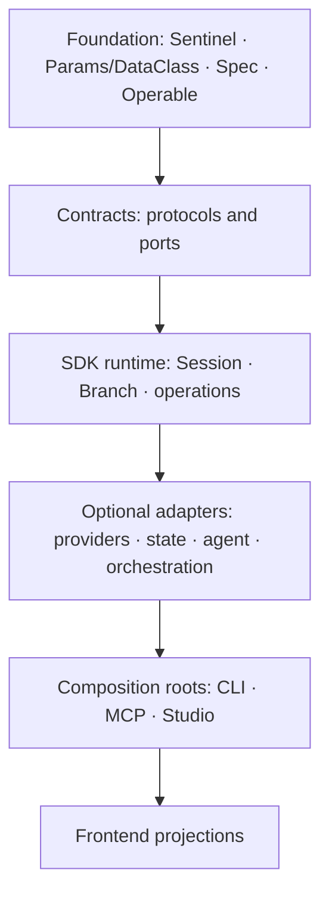
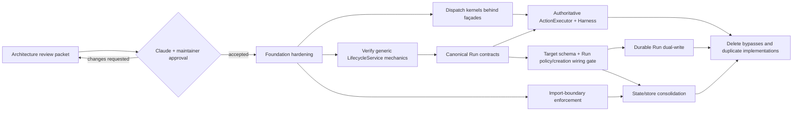

# Architectural consolidation program

- **Evidence baseline:** `origin/main` at `501d98abbfd55b8a0171c58b63ba671488cc77d7`
- **Issue snapshot:** 145 open issues on 2026-08-16
- **Decision state:** review packet; implementation is gated on acceptance of the linked ADRs
- **Primary objective:** make one declared contract own each behavior, then delete the parallel
  implementations after compatibility is proved

## Executive judgment

The repository is large because several concepts were implemented independently at the SDK,
CLI, StateDB, Studio, MCP, and frontend boundaries. The dominant problem is not file size by
itself. It is that the same fact is authored or inferred several times:

- persistence schema has six descriptions;
- callback dispatch has at least fifteen contracts spread over four different semantics;
- a "run" can mean a model turn, an engine context, a filesystem directory, a Session row, a
  schedule occurrence, or an MCP job;
- callable authorization is enforced on one operation path but bypassed by direct
  `ActionManager` and provider-native tool execution;
- the default installation carries StateDB, CLI, and other dependencies even when the caller
  only needs the SDK;
- the foundational `Sentinel`, `Params`/`DataClass`, `Spec`, and `Operable` stack is present but
  is not yet safe as a deterministic schema, policy, or wire-contract authority.

The program therefore does **not** start with a bulk folder move or a universal event bus. It
establishes six authorities, migrates callers behind compatibility projections, and deletes the
old authorities only after behavioral equality tests pass.

| Authority | Owns | Does not own |
|---|---|---|
| Foundational declaration substrate | absence semantics, immutable params, mutable contexts, ordered field specs, deterministic serialization | persistence, provider, UI, or lifecycle policy |
| Entity registry | persisted shape, codecs, generated SQLAlchemy metadata, schema diff inputs | lifecycle transitions, route behavior, provider transcript parsing |
| Dispatch kernels | ordered interception mechanics and signal fan-out mechanics | durable delivery policy or executable-event lifecycle |
| Action executor / harness | invocation admission, transformation, revalidation, enforcement evidence, provider capability compilation | flow scheduling, StateDB transactions, or OS sandbox guarantees it cannot provide |
| Run repository | durable execution-attempt identity, lineage, policy/config snapshot, outcome, workspace and Session links | reusable conversation state or schedule definition identity |
| Feature boundary manifest | allowed import edges, optional dependencies, composition roots, missing-extra errors | domain behavior |

No arrow may point upward. In particular, StateDB does not import provider implementations,
CLI and Studio do not import one another's implementation modules, and generic runtime code does
not select concrete providers.

## Measured baseline

The Python package contains 159,526 lines across 531 files at the evidence commit. The four most
operational packages account for 87,596 lines before frontend code:

| Package | Python lines |
|---|---:|
| `lionagi/studio` | 38,115 |
| `lionagi/cli` | 28,612 |
| `lionagi/state` | 14,027 |
| `lionagi/mcp` | 6,842 |

The default dependency set has seventeen entries and includes SQLAlchemy and aiosqlite even for an
SDK-only installation. Extras currently add capabilities but cannot remove code from the wheel;
the `sqlite` extra is compatibility-only because aiosqlite is already mandatory.

These measurements make a large reduction plausible, but “delete two thirds” remains a
hypothesis, not an acceptance criterion. A raw line target rewards compressed code and deleted
tests. The binding measures are:

1. one authority per fact;
2. zero bypasses around an enforcement owner;
3. zero forbidden import edges;
4. a minimal install that imports and runs the SDK without StateDB, CLI, Studio, MCP, or provider
   dependencies;
5. negative production-code growth over each completed migration wave;
6. deletion of the replaced implementation in the same wave that proves its replacement.

### Read-only dogfood evidence

The parallel architecture audit itself produced a concrete cross-surface correlation defect. Flow
manifest `20260816T172509-ab83af` reported `status="completed"`, while the distinct MCP **Job**
handle later reported `outcome="indeterminate"` with
`reason_code="process_gone_without_outcome"`. Those states are not required to be equal: ADR-0123
deliberately separates a control-plane Job from a Run-like execution record. The defect is that the
surfaces expose neither typed resource kinds nor a durable correlation explaining which evidence,
if any, may author canonical Run lifecycle.

StateDB detail was also unavailable because the installed runtime supports schema version 3 while
the local database records version 4. StateDB already raises typed `SchemaTooNewError`; the missing
work is to propagate and project that existing incompatibility through orchestration/UI instead of
collapsing it into absent detail or a generic missing-feature result.

The dogfood case therefore becomes two regression fixtures: retain both Job and manifest
observations with their own IDs, prove typed correlation and that only admitted Run evidence feeds
Run lifecycle; and prove `SchemaTooNewError` reaches the activation/degradation surface without
silently removing the durable adapter.

## Exhaustive open-issue clustering

Every issue in the snapshot appears exactly once below. The cluster identifies the most useful
current owner; it does not turn eight labels into eight merge epics. In particular, the issue
backlog currently under-represents hook architecture and optional packaging, while Run and Studio
contain many independent correctness defects that must not wait for a new ADR.

| Primary owner | Count | Issues |
|---|---:|---|
| Foundations / state / ADR-0118 | 14 | #1971, #2769, #2923, #3104, #3205–#3207, #3213–#3218, #3227 |
| Hooks / observation / delivery | 2 | #3203, #3211 |
| Harness / permissions / execution policy | 20 | #1195, #1196, #1381, #1382, #1393, #1973, #2069, #2161, #2387, #2394, #2653, #2664, #2921, #2956, #3003–#3005, #3028, #3130, #3194 |
| Modularity / provider / plugin boundary | 4 | #1175, #2048, #2367, #2779 |
| Canonical Run / lifecycle / lineage | 34 | #1678, #1975, #2068, #2077, #2232, #2389, #2390, #2535, #2576, #2578, #2582, #2658, #2748, #2755, #2969, #2978, #2979, #2998, #3018, #3026, #3051, #3066, #3111, #3112, #3118, #3119, #3127, #3129, #3134, #3189, #3197, #3201, #3202, #3204 |
| Orchestration / workflow / scheduler | 19 | #1197, #1254, #1383, #1698, #2015, #2833, #2836, #2888, #2924, #2928, #2932, #2935, #3040, #3053, #3109, #3116, #3117, #3188, #3230 |
| Studio / frontend / product | 36 | #1714, #2366, #2732, #2843, #2846, #2933, #3011–#3013, #3016, #3032–#3034, #3054–#3057, #3059–#3065, #3105–#3107, #3110, #3113, #3115, #3126, #3128, #3179, #3181, #3183, #3228 |
| Quality / release / docs | 16 | #1679, #2152, #2727, #2736, #2756, #2966, #3044–#3049, #3085–#3087, #3191 |
| **Total** | **145** | no duplicates and no omissions |

### Architectural dispositions

- **ADR-0118:** rescope #3213–#3218 as described below. Merge #3205 and #3227 into
  #3214's generated-object parity fixtures. Link but do not absorb #3207. Keep #3201–#3204 as
  lifecycle/result/delivery/audit correctness, not persistence-schema declaration.
- **Hooks:** create a new ADR/epic after approval because only #3203 and #3211 currently represent
  the area. #3211 remains an independent drain/ownership fix. #1679 is CI-worker instability, not
  hook evidence.
- **Harness:** consolidate #1196, #1381, the authoritative-controller slice of #2161, #1973,
  #3028, #3130, and #3194 under ADR-0121. Narrow #1393 to evidence/TaskCertificate policy;
  keep #2069 peer authentication and #2394 request lifecycle independent. Do not invent one
  `Capability` base for emission grants, tool permissions, and worker requirements.
- **Modularity:** create a new epic only after ADR-0122 is accepted. #1175, #2048, #2367, and
  #2779 remain adapter/product issues; #2779 is a useful missing-extra/degradation acceptance
  case, not the packaging design itself.
- **Run:** preserve child acceptance tests. Group lifecycle ownership (#2068/#2077), cost
  attribution (#2232/#3127), provenance (#2664 residual, #2956, #3026, #3197), artifact evidence
  (#2390/#3118/#3128), hierarchy/attempts (#2582/#3051/#3111/#3119), provider recovery
  (#2932/#2935), escalation semantics (#2888/#2924), backend attention (#2979), and per-leg
  served model (#3189). Process-supervision defects #2535, #2576, #2748, #2755, and #3129 stay
  independently actionable.
- **Studio and quality:** product fixes, install/release gates, test defects, and documentation
  work remain separate lanes. Frontend types become generated or contract-tested projections of
  backend contracts, but existing UI fixes do not wait for that migration.

### Close, merge, or let an existing PR own

These dispositions reduce backlog before creating any new epic:

| Issues | Action and evidence |
|---|---|
| #2966 | Closed during this review after verifying the fix in `78d179b5` / PR #3006. |
| #3003 | Closed during this review after verifying the shared secret-key rule in `9901dfed` / PR #3002. |
| #3016, #3033, #3034 | Closed during this review after verifying graph-source, stream-settlement, and predicate-semantics work from PR #3009 on main. |
| #3230 | Merge its residual intent into #3109, then close; closed-unmerged PR #3229 is not current code, and main still uses whole snapshots. |
| #2152 | Merge into #1679, the existing Python 3.14/xdist worker-crash umbrella. |
| #3045–#3049 | Merge into #3044; mechanical comment trimming is not architectural code reduction and should be remeasured after consolidation. |

The following open PRs already own their named issues. Mark them close-after-merge-and-verification
instead of absorbing them into ADR epics:

| Open PR | Owned issues |
|---|---|
| #3037 | #3012, #3059, #3060, #3064 |
| #3036 | #3032, #3055, #3062, #3063 |
| #3039 | #3004, #3005, #3061 |
| #3038 | #3066 |
| #3142 | #3110–#3113 |
| #3236 | #3188 |

PR #3234 addresses scheduled pruning but not #2769's VACUUM/compaction decision. PR #3237 adds
host/boot PID identity but does not close #2576's verify-and-signal race or #2748's durable
unresolved-state requirement.

### Missing work revealed by triage

No existing issue owns the foundational blocker: ordered field identity, structural equality,
canonical serialization, dataclass defaults/default factories, and Sentinel semantics must be
correct before ADR-0118 can safely hash declarations across processes. ADR-0119 owns the decision;
its accepted phases should become narrow implementation issues.

No existing issue owns the hook taxonomy or optional dependency/import-boundary program. New epics
are created only after ADR-0120 and ADR-0122 are accepted, avoiding speculative issue churn while
review may still change their boundaries.

## ADR program

The design PR contains seven coordinated records:

1. **ADR-0118 amendment — declared entity schema.** Narrow it to persistence declaration,
   compilation, physical parity, migration, and store ownership. Remove provider moves and
   generic dispatch design from its implementation phases.
2. **Foundational declaration substrate.** Decide absence, mutability, order, equality/hash,
   defaults, canonical serialization, adapter ownership, and explicit registry composition.
3. **Interception, signals, and durable delivery.** Keep four semantic planes while sharing only
   the ordered-interceptor and fan-out mechanics.
4. **Authoritative action execution and native agent harness.** Close every local callable/MCP
   bypass, compile neutral policy into provider capabilities, and bind enforcement evidence to a
   Run.
5. **Feature boundaries and optional installation.** First enforce a one-way import graph and
   extras in one distribution; decide a multi-distribution split only after those seams hold.
6. **Canonical Run identity and projections.** Make Run one durable execution attempt, Session
   reusable conversation state, Invocation the submitted/admitted request, and workspace a
   linked resource rather than an identity.
7. **Invocation terminal callback cutover.** Decide which source may publicly announce that an
   attempt finished while both the legacy and canonical answers exist, and what has to be proved
   before the default flips.

Record 7 was a clause of record 6 in an earlier revision and was separated on review. The two
have different shapes: Run identity is a modelling decision a reviewer evaluates by reading it,
while the cutover is a distributed protocol whose failure modes, silent double delivery and
silent non-delivery, raise nothing at the source and are visible only from the consumer's side.
Kept together, the identity model could not be accepted until the protocol was settled, and the
protocol would be read at the confidence a reviewer had already formed about the model.

The records are reviewed together because their type boundaries cross-reference one another;
they are accepted and implemented independently.

## ADR-0118 rescope

ADR-0118 is approved in direction and requires amendment before implementation.

### Required corrections

1. `EntitySpec` is built from the accepted foundational primitives after their hardening gate;
   it is not a new parallel frozen-dataclass hierarchy.
2. Registry composition is explicit and deterministic. Importing a model does not mutate a
   process-global registry.
3. Provider transcript mirrors are outside persistence schema authority. Their destination is
   decided by the module-boundary ADR; Phase 0 does not move them speculatively.
4. The lifecycle projections depend on the registry and therefore cannot move in Phase 0. They
   remain two axes: seven current LifecycleService policies including `dispatch`, versus six
   generic `StateDB.update_status()` facade values. Target adds Run only to the policy projection
   unless a later compatibility decision expands the facade. Domain reason codes are a third axis.
5. “Shared executor” in D6 becomes `StateStore`/`TransactionRunner`; it is not the generic event
   executor, action executor, or flow scheduler.
6. Generic dispatch/terminal-callback convergence leaves D10 and is owned by the hook/delivery
   ADR. ADR-0118 retains only the StateDB-specific post-commit ordering requirement.
7. PostgreSQL quarantine requires a server-enforced read-only role or hot standby.
   `default_transaction_read_only` is defense in depth only and does not satisfy quarantine.
8. ADR-0056 clauses superseded by the generated authority are named explicitly when ADR-0118 is
   accepted.
9. Compiler proof uses fixture-only `LegacyBaselineRegistry`/`LegacyBaselineManifest`; the distinct
   `TargetRegistry`/`TargetSchemaManifest` contains accepted Run changes, and their declaration diff
   equals an authored change set. Each physical legacy variant has its own preapproved migration
   plan; a live diff never approves itself. Target objects never have to equal current MetaData.
10. The schema manifest classifies tables, indexes, triggers, views, dependent functions, and
    extension/transitional objects exactly once; raw catalog DDL is never replayed.
11. Persistent inspection/connectivity or safe-read-only-enforcement failure returns typed
    `Unavailable` with no handle. Only a complete snapshot plus an enforced read-only handle can be
    `Quarantined`.

### Corrected phases

| Phase | Deliverable | Merge gate |
|---|---|---|
| Foundation gate | harden defaults, order, equality/hash, canonical serialization; record current behavior | foundational ADR accepted; cross-process determinism tests pass |
| 0 | legacy baseline and physical-variant fixture corpus; decide current divergences; freeze all catalog-object inventories | no production behavior or module moves |
| 1 | shared compiler, legacy-baseline and target registries/manifests, authored target change set, generated SQLAlchemy objects in shadow mode | baseline equals pinned production MetaData; target equals its declarations; declaration diff equals authored changes |
| 2 | SQLite/PostgreSQL catalog + ownership/dependency adapters, must-fail mutation fixtures, observe-only deployed diff, authored data transforms | every field/object semantic has an independently red fixture; unavailable/quarantine matrix passes; no writes |
| 3 | generated CRUD/codecs in shadow/equality mode | statement/result equality; identifier validation; public dict compatibility |
| 4 | per-variant preapproved migration application, authored extension recreation, post-apply verification, old-authority deletion | live snapshot matches a recognized variant and plan digest; complete target re-introspects ReadyReadWrite; no catalog-DDL replay |
| 5 | Studio/operator tables and connection paths move behind StateStore | transitional catalog manifest empty across tables/triggers/views; no direct Studio DDL/connections |

This changes issue scopes as follows:

- #3213 becomes Phase 0 fixture/inventory work and no longer contains mirror or registry-derived
  vocabulary moves.
- #3214 covers the shared compiler, separate legacy/target declaration snapshots, authored target
  change set, and their shadow gates—not target-to-legacy or live catalog parity.
- #3215 owns physical catalog and ownership/dependency adapters, the mutation-proven parity gate,
  unavailable/quarantine fault matrix, observe-only deployed diff, and authored data-migration
  catalog.
- #3216 remains generated CRUD shadowing.
- #3217 must remove `default_transaction_read_only` as an acceptable quarantine mechanism.
- #3218 retains the final ownership/connection migration and uses `StateStore` terminology.

## Sequencing and approval gates

Before approval:

- ADR and issue text may change;
- characterization tests and design-independent safety fixes may land in separate draft PRs;
- no new registry, dispatch kernel, Run table, package split, public rename, or permission rewrite
  is implemented.

After approval:

1. create one implementation epic per accepted ADR;
2. rescope or link existing issues rather than duplicating them;
3. create only the missing child issues named by the ADR delta/gate tables;
4. require each implementation PR to name the old authority it deletes or the later gated phase
   that will delete it;
5. stop and amend the ADR when equality or clean-install evidence contradicts the design.

## Quick-win policy

A quick win is eligible before ADR approval only when all of these are true:

- it fixes a demonstrated current-contract violation;
- it does not choose a contested target abstraction, folder, or public name;
- it has a regression test over both the refusal and unchanged-success arms;
- its long-term deletion/replacement is already explicit;
- it is published in a separate draft PR.

Eligible now:

- #3207: add the existing `require_file_store` guard to the three SQLite-direct Studio service
  paths that omit it. Phase 5 later deletes the direct path.
- delete the orphaned filesystem-run adapter chain left after PR #1808 removed its sole root:
  `_adapt_summary`, `_build_graph`, `_summarize_args`, `_extract_messages`, and `_build_steps`,
  plus the unused frontend `RunDetail` type/`getRun()` wrapper. Retain `_detect_status`, which has
  live Session/operator consumers. Backend and full frontend suites prove no route behavior moves.
- remove the unsupported subagent `permissions="inherit"` option advertised by its request schema
  after a focused construction test; the current default remains `read_only`, while true
  inheritance remains ADR-0121 work using `Unset` and a resolved snapshot.
- #2966 closure was completed during triage after current-main verification; it is recorded here
  as evidence of the quick-win rule rather than remaining publication work.

Not eligible without ADR approval:

- deleting `Broadcaster`, dormant hook points, or public error-hook fields;
- changing `Params`, `Meta`, `Spec`, `Operable`, or `OperableModel` behavior;
- moving provider mirrors;
- inventing the entity registry or canonical Run tables;
- renaming public hook, event, capability, permission, Session, or Run surfaces.

## Settled questions

Each open question this packet raised is answered here, with the conditions that came back with
it. A condition is part of the answer: where one is stated, implementation of that area starts
after the condition is met, not before.

1. **Three-state `Undefined` / `Unset` / `None` for every new configuration surface.** Yes, after
   ADR-0119 D2 lands. Until declared defaults are applied, `Unset` means both "present but
   unresolved" and "the declared default was never applied", so the distinction the contract rests
   on is not yet observable. The `none_as_sentinel` and `empty_as_sentinel` carve-out is a closed
   enumerated list of call sites, not a capability an adapter can claim.
2. **Explicit registry composition over import-time self-registration.** Yes, without
   reservation. `build_default_registry()` in `lionagi/state/lifecycle/policy.py` is the reference
   implementation, so the remaining registries are an alignment rather than an invention. The
   error raised when an uncomposed optional fragment is queried is ADR-0122 D4's missing-feature
   error; neither record defines its own.
3. **Four-plane taxonomy; observation never vetoes, authorization never suppresses committed
   audit.** Yes. The gate for the phase that splits them has three arms, and the third is the one
   current code fails silently: a gate that *raises* must still persist the audit record. Today it
   does not, and nothing signals that.
4. **`ActionExecutor` as the sole LionAGI-owned callable and MCP boundary.** Yes. Three routes
   with three different control sets exist today, and the gap on the manager route is Session
   authorization specifically rather than controls in general. The policy round-trip is the other
   half: a declared policy is read correctly and then dropped on write, always toward fewer
   restrictions.
5. **Run as one durable attempt, Session reusable state, resume always a new Run, one writer
   lease, PlanDelta only.** Yes on all four. The database already models the one-Run-to-many-
   Sessions relation through a distinct `sessions.run_id` column, while the API overwrites that
   field with the session id, so the two values disagree in one system today. That is a live
   defect with its own issue, independent of this program.
6. **One-distribution import-boundary phase before deciding a wheel split.** Yes, and the evidence
   is stronger than an inversion. `cli` and `studio` import each other, which is a cycle: no
   ordering of two distributions satisfies it, so breaking it is a precondition of the split
   rather than part of it.
7. **ADR-0118 rescope.** Yes on the lifecycle projection, which matches the six-key status map and
   seven registered policies that exist. Two hardenings are folded in: quarantine is enforced by
   the connection rather than by a session setting anything can turn off, and a live diff neither
   approves nor clears a store, so an unrecognized variant is quarantined or unavailable and never
   "no migration needed".
8. **ADR-0087 retained: EvidenceStore, hash chain, certificate; pre-call append blocks; StateStore
   projections only.** Yes. Its `not-started` implementation status is accurate against the code.
   One gap is closed here: the active runtime profile is a required field on `ExecutionOutcome`,
   because a caller that believes it is governed and is silently minimal is the exact
   false-security failure the profiles exist to prevent.
9. **ADR-0058 as the sole Run transition authority; legacy terminal mapping.** Yes on the
   authority, which matches what already shipped. No on "complete": the mapping table gains the
   contradictory row that production data already contains and the read path already detects, a
   Session reporting `running` with a non-null `ended_at`. ADR-0058's own implementation-status
   line was re-derived at HEAD and corrected in this packet.
10. **Named dispatcher profiles and the CommitParticipant / DeliverySink split.** Yes,
    conditionally. The eight profiles pin real differences that would otherwise be normalized
    away, but they are asserted rather than measured. Each row needs a characterization test
    written against current code that goes red when the row is wrong, and that is a merge gate on
    the phase that adapts the buses, not only a deliverable of the phase before it. Removing
    `DISCARD_UNAWAITED` is a behavior change rather than cleanup and gets its own gate and a named
    owner.

Implementation of an area begins once its answer above carries no unmet condition.
