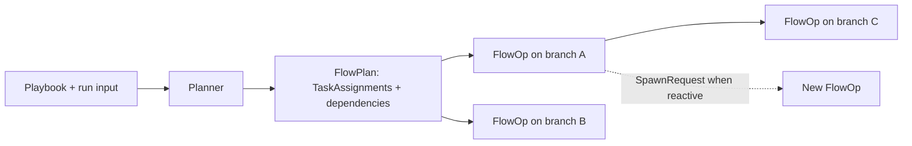

# From Playbook to FlowOp

LionAGI exposes three related orchestration tiers. They are not three names for
the same object:

| Tier | Question it answers | Lifetime |
|------|---------------------|----------|
| **Playbook** | What reusable defaults and prompt should this kind of run start from? | A declarative `.playbook.yaml` file |
| **FlowPlan** | What work and dependencies should this particular input produce? | The planner's `list[TaskAssignment]` for one run |
| **FlowOp** | What does one branch do next? | One operation node in the live run graph |

The code does not define a `FlowPlan` container class. The runtime representation
is a list of `TaskAssignment` values with `task`, `assignee`, `inputs`,
`exit_criteria`, `depends_on`, and `modes`. “FlowPlan” names that run-specific
planning tier. Source: `lionagi/orchestration/patterns.py` and
`lionagi/casts/emission.py`.



The playbook does not contain the DAG. The orchestrator model creates the
FlowPlan from the playbook's prompt and the current input. The builder then
turns every assignment into an `operate` node bound to a worker branch and
wires its declared dependencies. With reactivity enabled, accepted
`SpawnRequest` values add operations to that live graph without rerunning the
initial planner. Source: `lionagi/cli/orchestrate/flow.py` (`_run_flow_inner`,
`_build_dag`, and `_execute_dag`) and `lionagi/orchestration/patterns.py`
(`role_node_builder`).

## A complete example

Save this as `.lionagi/playbooks/repo-audit.playbook.yaml`:

```yaml
model: codex
prompt: |
  Audit {input}. Inspect its public API, identify the highest-impact gap,
  and verify the final finding against the source.
max_ops: 4
reactive: "off"
with_synthesis: true
artifacts:
  expected:
    - id: audit-report
      path: synthesis.md
      required: true
      description: Final evidence-backed audit
```

Then preview and run it:

```bash
li play repo-audit . --dry-run
li play repo-audit . --save ./lion-results/repo-audit
```

The filename supplies the discovered playbook name. `{input}` receives the
positional `.`. The actual plan is model-produced, but a valid FlowPlan for this
input could have this shape:

```yaml
assignments:
  - task: Inspect the public API and record evidence for gaps.
    assignee: researcher
    inputs: []
    exit_criteria: Every claimed gap cites source evidence.
    depends_on: []
    modes: []
  - task: Rank the documented gaps and verify the highest-impact finding.
    assignee: analyst
    inputs: [inspection findings]
    exit_criteria: One finding is selected and independently verified.
    depends_on: ["1"]
    modes: [evidential]
```

For the second assignment, one FlowOp is an `operate` invocation on the
analyst's branch. Its instruction is the assignment's `task`; its incoming graph
edge points to step 1; its context includes the original task and artifact
locations. That node invocation—not the whole branch and not the whole plan—is
the FlowOp. Source: `lionagi/cli/orchestrate/_common.py`
(`_build_worker_operate_node`) and `lionagi/cli/orchestrate/flow.py`
(`_build_dag`).

At present, `inputs` and `exit_criteria` remain plan metadata: `_build_dag`
does not copy either field into the FlowOp instruction or context. Authors
should put execution-critical constraints in the playbook prompt rather than
assuming those two planner fields reach the worker. Source:
`lionagi/cli/orchestrate/flow.py`.

`--dry-run` displays the planner's declared assignments and dependencies but
does not build the run graph. `--show-graph` writes the graph only during
post-execution finalization. Source: `lionagi/cli/orchestrate/flow.py`.

## Choose the lightest surface

| Need | Surface | What it adds |
|------|---------|--------------|
| Independent perspectives or repeated copies of one task | `li o fanout` / `fanout.submit` | A bounded decomposition followed by dependency-free parallel nodes |
| Work whose later steps consume earlier results | `li o flow` / `flow.submit` | A run-specific dependency graph and optional reactive expansion |
| The same flow prompt and defaults reused by name | `li play` / `play.submit` | A saved declaration that still enters the normal planning path on every run |

Prefer fan-out when the work is genuinely independent. In `fanout.py`, every
worker node is built with `depends_on=[]`, while `flow.py` normalizes and wires
the planner's dependency references. A playbook improves reuse; it does not
freeze a FlowPlan or remove the planning turn. `li play` is rewritten to
`li o flow -p NAME` by `lionagi/cli/main.py`.

Recorded runs show flat fan-outs completing far more reliably than saved
playbook runs. The dominant saved-playbook failure is a FlowPlan too large for
its execution window. The mechanics make that risk concrete: the flow timeout
covers planning, execution, and synthesis, and the worker budget is divided by
the initial assignment count. Cap and preview planned flows; do not choose a
playbook merely because the task sounds important. Source:
`lionagi/cli/orchestrate/flow.py` (`_run_flow` and `_run_flow_inner`).

## Reactive runs need spare capacity

`reactive` defaults to `all`. It can be `off` or a comma-separated role
allowlist. An allowed worker may emit a `SpawnRequest`; the executor converts an
accepted request into another FlowOp. Source: `lionagi/cli/orchestrate/flow.py`
(`_parse_reactive`) and `lionagi/casts/emission.py` (`SpawnRequest`).

For a positive `max_ops` ceiling, the fresh-run arithmetic is:

```text
spawn capacity = max(0, max_ops - initial planned assignments)
```

A four-assignment plan under `max_ops: 4` therefore has zero spawn capacity,
so its workers are not granted the spawn tool. The reactive state and effective
`max_spawn` are recorded in the flow checkpoint and Studio run metadata. Size
the ceiling as:

```text
max_ops = intended initial plan + intended reactive spawns
```

For example, budget six operations for an expected four-node plan plus two
possible follow-ups. With no explicit ceiling (`max_ops: 0`), initial planning
is uncapped by this setting but the executor still limits reactive spawns to 20.
Restored spawns consume the same budget on resume. Source:
`lionagi/cli/orchestrate/flow.py` (`_execute_dag`).

Quote the disabled value in YAML:

```yaml
reactive: "off"
```

PyYAML parses bare `off` as boolean false, while the playbook loader requires
`reactive` to be a string. Because validation occurs in the spawned CLI child,
an MCP `play.submit` can return a run ID before that type error ends the run.
Source: `lionagi/cli/orchestrate/__init__.py`, `lionagi/mcp/dispatch.py`, and
`lionagi/mcp/jobs.py`.

## Playbook field reference

The runtime fields below are the ones `_validate_spec_fields` in
`lionagi/cli/orchestrate/__init__.py` type-checks when they are present. That
function is a type and bounds check, not a field list: it enumerates no closed
set and rejects no unknown key, so its absence from that function does not make
a key inert. The declaration fields are listed separately after the table
because a different code path reads them. CLI flags override file defaults.

| Field | Accepted value | Runtime effect |
|-------|----------------|----------------|
| `model` | string | Default orchestrator model |
| `agent` | string | Default orchestrator profile |
| `effort` | `none`, `minimal`, `low`, `medium`, `high`, `xhigh`, `max`, or `ultra` | Default reasoning effort |
| `prompt` | string | Prompt template; `{input}` is replaced by positional input |
| `workers` | integer 1–32 | Maximum concurrently running planned operations when the CLI concurrency flag is unset |
| `max_ops` | integer 0–50 | Preferred total-operation ceiling; `0` leaves initial planning uncapped but retains the default reactive-spawn limit |
| `max_agents` | integer 0–50 | Deprecated alias for `max_ops` |
| `with_synthesis` | boolean or model string | Enable final synthesis, optionally with that model |
| `bare` | boolean | Ignore worker profiles and use the CLI model |
| `dry_run` | boolean | Plan and print without building or executing a graph |
| `show_graph` | boolean | Write the graph visualization during finalization |
| `save` | string | Default artifact directory |
| `team_mode` | string | Create a fresh named team |
| `team_attach` | string | Attach to or create a persistent named team; mutually exclusive with `team_mode` |
| `reactive` | string | `all`, `off`, or a comma-separated role allowlist |
| `artifacts` | mapping with `expected` list | Declare output files verified at completion |

Each `artifacts.expected` entry requires an alphanumeric, `_`, or `-` `id` and
a relative, non-glob `path`. `required` defaults to true; `description` is
optional. Source: `lionagi/state/artifact_verifier.py`.

### Declaration fields

These describe the playbook's own command-line interface rather than the run,
and they are read on a separate path from the table above.

| Field | Accepted value | Effect |
|-------|----------------|--------|
| `description` | string | Printed by `li play NAME --help` |
| `args` | mapping of name to `{type, default, help}` | Becomes real CLI flags; `type` is `str`, `int`, `float`, or `bool` |
| `argument-hint` | string such as `'[--mode MODE] [--strict]'` | Parsed into the same schema shape, used only when `args` is absent |

`args` is checked by `_validate_args_schema`, which fails the run on a
malformed schema, and injected as parser flags by
`inject_playbook_schema_into_parser`. `argument-hint` is parsed by
`_parse_argument_hint`. A declared arg is substituted into `prompt` as
`{arg_name}`, with a CLI value overriding the playbook default. Source:
`lionagi/cli/orchestrate/__init__.py` and `lionagi/cli/main.py`.

The loader currently runs `_validate_spec_fields` only after the child process
has loaded the file. Submission resolving the playbook and returning a run ID
is not a successful validation. Source: `lionagi/cli/orchestrate/__init__.py`,
`lionagi/mcp/projection.py`, and `lionagi/mcp/jobs.py`.

## Observe a submitted run

The MCP submit verbs are asynchronous handles. `fanout.submit`, `flow.submit`,
and `play.submit` return an allocated `run_id`, process metadata, and current
spawn state—not the worker result. Source: `lionagi/mcp/jobs.py` (`submit`).

Use that ID to read the three different things callers commonly conflate:

```json
{"ops":[{"op":"job.status","args":{"run_id":"<run_id>"}}]}
```

`job.status` answers lifecycle and liveness. Branch on `terminal` and `outcome`,
not merely the open-ended display `status`.

```json
{"ops":[{"op":"job.output","args":{"run_id":"<run_id>"}}]}
```

`job.output` returns the console tail plus the persisted artifact list and an
`artifacts_state` that distinguishes an empty list from an unreadable one. Use
`job.wait` when the caller should block for a bounded interval instead of
polling. Source: `lionagi/mcp/dispatch.py` and `lionagi/mcp/jobs.py` (`status`,
`output`, and `wait`).

For an interactive CLI flow, use `li o ctl status ID` for lifecycle state and
the printed `--save` directory for artifacts. A `--background` launch instead
prints a session ID and writes `flow.log`; that path is separate from the MCP
submit contract. Source: `lionagi/cli/orchestrate/__init__.py`.

Next, learn how to [observe, control, and resume durable work](durable-operations.md).
